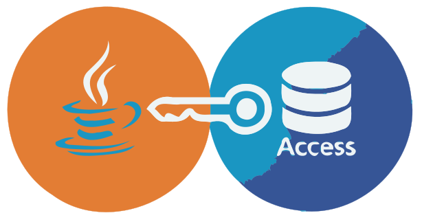

<div align="center">
  <a href="https://central.sonatype.com/artifact/io.github.spannm/ucanaccess"></a>
  
  <a href="https://github.com/spannm/ucanaccess/stargazers"></a>
  <br>
  <a href="https://github.com/spannm/ucanaccess/actions/workflows/ci_jdk11_ubuntu.yml"></a>
  <a href="https://github.com/spannm/ucanaccess/actions/workflows/ci_jdk11_win.yml"></a>
  <a href="https://javadoc.io/doc/io.github.spannm/ucanaccess"></a>
  <a href="https://apidia.net/mvn/io.github.spannm/ucanaccess"></a>
</div>

<h1 align="center">UCanAccess</h1>
<h3 align="center">The modern bridge between Java and Microsoft Access</h3>

**UCanAccess** is a open-source pure-Java JDBC driver that gives you seamless access to Microsoft Access databases (`.mdb`, `.accdb`) without needing any native Windows libraries - R.I.P. `OdbcJdbcBridge` 🪦.

<p>
  <strong>New to UCanAccess?</strong> Check out the introduction guide on 
  <a href="https://foojay.io/today/ucanaccess-java-ms-access-jdbc-guide/">Foojay.io: UCanAccess – Java MS Access JDBC Guide</a>
</p>

<div align="center">
  
</div>

## ✨ Key Features

* **Pure Java Power**: Zero native dependencies. Runs anywhere Java 11+ is supported.

* **Drop-in Replacement**: Fully compatible with previous UCanAccess versions.

* **Modern Core**: Built on top of the latest **Jackcess 5.1.5** and **HSQLDB 2.7.4** for maximum stability and security.

* **Comprehensive SQL Support**: Supports SELECT, INSERT, UPDATE, DELETE, and even complex DDL operations like `ALTER TABLE`.

* **Access-like Logic**: Includes built-in Access functions (like `IIf`, `Nz`, and financial functions like `PMT` or `PV`).

* **Security Conscious**: Regularly updated to be free of known CVEs.

<p style="height: 20px;">&nbsp;</p>

## 🛠 Tech Stack & Requirements

* **Java Version**: 11 or higher (LTS versions like Java 17 and 21 are fully supported and tested).

* **Build Tool**: [Maven](https://maven.apache.org/)

* **Main Dependencies**:

    * [Jackcess](https://github.com/spannm/jackcess/)

    * [HyperSQL Database (HSQLDB)](http://hsqldb.org/)

<p style="height: 20px;">&nbsp;</p>

## 📦 Installation

To use UCanAccess in your project, add the following dependency.

### Maven (`pom.xml`)

```xml
<dependency>
    <groupId>io.github.spannm</groupId>
    <artifactId>ucanaccess</artifactId>
    <version>5.1.5</version>
</dependency>
```

### Gradle (Groovy / `build.gradle`)

```groovy
implementation 'io.github.spannm:ucanaccess:5.1.5'
```

### Gradle (Kotlin DSL / `build.gradle.kts`)

```kotlin
implementation("io.github.spannm:ucanaccess:5.1.5")
```

<p style="height: 20px;">&nbsp;</p>

## 🚦 Quick Start

Connecting to your database is as simple as:

```java
import java.sql.Connection;
import java.sql.DriverManager;

String url = "jdbc:ucanaccess://C:/path/to/your/database.accdb";
try (Connection conn = DriverManager.getConnection(url)) {
    // your code here
}
```

<p style="height: 20px;">&nbsp;</p>

## ❤️ Why this Fork?

The original project (developed by Marco Amadei and Gord Thompson) was the gold standard for Access connectivity but went quiet in 2020.
As a long-time contributor and Java enthusiast, I decided to give UCanAccess a **new home**.

My goal is to keep this essential tool alive, maintain a **high test coverage** (JUnit 5), and ensure it meets modern **Clean Code** and **SOLID** standards.

<p style="height: 20px;">&nbsp;</p>

## 🤝 Contributions welcome!

Got a bug to fix or a feature to add?

1. Check out the [Issues](https://github.com/spannm/ucanaccess/issues)
2. [Fork](https://github.com/spannm/ucanaccess/fork) the Repo
3. Submit a [Pull Request](https://github.com/spannm/ucanaccess/pulls)

*Note: Please ensure your code follows the project's quality standards (Checkstyle, PMD are enforced in the build)*.

<div align="center"> ─────────────── </div>

### ⚖️ License

UCanAccess is licensed under the **Apache License, Version 2.0**.

<p style="height: 40px;">&nbsp;</p>

<div align="center">
<table style="border-collapse: collapse;">
  <tr>
    <td style="padding: 40px; border: 2px solid #3a82c2;">
      <strong>Enjoying UCanAccess? Please leave a 🌟 to support the project!</strong><br>
      <small>Your stars help to keep the bridge between Java and Access alive and visible.</small>
    </td>
  </tr>
</table>
</div>
