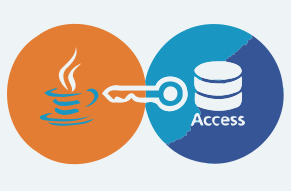

# UCanAccess: The Modern Pure-Java Bridge to Microsoft Access

---

Microsoft Access databases are everywhere. Decades of `.mdb` and `.accdb` files silently power spreadsheets, small business applications, and legacy data stores across organizations of all sizes. Yet for Java developers, connecting to these files has historically meant wrestling with native Windows libraries, ODBC bridges, and platform-specific hacks.

**UCanAccess** puts an end to that. It is an open-source, pure-Java JDBC driver that lets you read and write Microsoft Access databases (`.mdb` and `.accdb`) just like any other SQL database — no native drivers, no Windows dependency, no friction.

<p align="center">
  
</p>

---

## A Brief History

UCanAccess was originally created by Marco Amadei and Gord Thompson and quickly became the go-to solution for Java-to-Access connectivity. The project was invaluable, but development went quiet around 2020. After a period of community reliance on an unmaintained codebase, the project was forked and revived in 2022 by its current maintainer, ensuring the lights stay on and the code stays clean.

The current fork is not just a maintenance release. It is an active effort to modernize the codebase: adopting JUnit 5, enforcing strict clean code standards with Checkstyle and PMD, keeping dependencies minimal and CVE-free, and continuously improving test coverage.

---

## What Problems Does It Solve?

### The Disappeared Bridge

Java dropped the `sun.jdbc.odbc.JdbcOdbcBridge` in Java 8 — the legacy workaround for reaching Access databases via ODBC. Many projects were left stranded. UCanAccess serves as its pure-Java replacement, filling that gap permanently.

### Cross-Platform Compatibility

Because UCanAccess is 100% Java with zero native code, it runs on Linux, macOS, and Windows alike. This is essential for containerized environments, CI/CD pipelines, and server-side applications where installing Windows ODBC drivers is not an option or undesired.

### Seamless Integration for Tooling

UCanAccess is not just for bespoke Java applications. Software environments that speak JDBC — such as **LibreOffice Base**, **OpenOffice**, **DbVisualizer**, **SQuirreL SQL**, **DBeaver**, and **MATLAB** — can connect to Access files through UCanAccess without any extra configuration.

---

## Tech Stack & Requirements

- **Java 11 or higher** (LTS versions 17 and 21 are fully tested)
- **Build tool**: Maven or Gradle
- **Core dependencies**:
  - [Jackcess](https://github.com/spannm/jackcess): handles low-level binary Access file access
  - [HSQLDB](http://hsqldb.org/): provides the in-memory SQL engine for query translation
- **License**: Apache License 2.0

---

## Getting Started

### Add the Dependency

**Maven (`pom.xml`):**

```xml
<dependency>
    <groupId>io.github.spannm</groupId>
    <artifactId>ucanaccess</artifactId>
    <version>5.1.5</version>
</dependency>
```

**Gradle (Kotlin DSL):**

```kotlin
implementation("io.github.spannm:ucanaccess:5.1.5")
```

### Connect and Query

Connecting is as simple as using any standard JDBC driver. No class registration or native driver setup is required:

```java
import java.sql.*;

// path to that legacy file someone "forgot" to migrate in 2010
String url = "jdbc:ucanaccess:///data/legacy_system_final_v2_REAL.accdb";

try (Connection conn = DriverManager.getConnection(url);
     Statement stmt = conn.createStatement();
     ResultSet rs = stmt.executeQuery("SELECT Name, Role FROM Foojay")) {

    while (rs.next()) {
        System.out.println(String.format("Friend found: %s (%s)",
                           rs.getString("Name"), rs.getString("Role")));
    }
} catch (SQLException ex) {
    System.err.println("Database access failed: " + ex);
}
```

No class registration, no native driver setup.
Standard `DriverManager.getConnection()` is all you'll need.

### Write Data Back

UCanAccess supports full **DML** (Data Manipulation Language) — both reads and writes. Even some **DDL** operations like `ALTER TABLE` are supported:

```java
String insert = "INSERT INTO passwd (Id, UserName, Password) VALUES (?, ?, ?)";

try (Connection conn = DriverManager.getConnection(url);
     PreparedStatement ps = conn.prepareStatement(insert)) {

    // adding some highly secure legacy credentials
    ps.setInt(1, 42);
    ps.setString(2, "admin");
    ps.setString(3, "alligator3");

    int rowsAffected = ps.executeUpdate();

    System.out.println(String.format("Successfully updated %d row", rowsAffected));
} catch (SQLException ex) {
    System.err.println("Failed to update credentials: " + ex);
}
```

### Access-Specific Functions

One common pain point when working with Access queries is the use of Access-specific SQL functions that standard JDBC drivers simply do not understand. UCanAccess ships with built-in emulations of the most common ones — `IIf()`, `Nz()`, `Format()`, and financial functions like `PMT()` and `PV()`. Queries originally written for Access often run without any modification at all.

### Uber JAR for Non-Maven Projects

If you are integrating UCanAccess into a tool that does not use Maven — such as LibreOffice Base or SQuirreL SQL — the project ships an **uber JAR**: a single self-contained archive with all dependencies bundled in. You can download it directly from [Maven Central](https://central.sonatype.com/artifact/io.github.spannm/ucanaccess) and drop it onto the classpath without any further setup.

---

## Quality & Maintenance

The active fork maintains a high bar for code quality:

- **Static analysis**: Checkstyle and PMD are enforced on every build.
- **Testing**: A robust JUnit 5 suite runs on both Linux and Windows via GitHub Actions CI.
- **Security**: Regular dependency updates keep the library free of known CVEs.
- **Distribution**: Every release is published to Maven Central for straightforward integration.

---

## Get Involved

UCanAccess lives at [github.com/spannm/ucanaccess](https://github.com/spannm/ucanaccess). Whether you have a bug to report, a feature idea, or want to contribute a test case, contributions are warmly welcomed.

If UCanAccess has helped you keep a legacy system running or simplified a migration, consider dropping a ⭐ on GitHub — it helps the project stay visible and signals to the community that this bridge is alive and well-maintained.

---

*UCanAccess is licensed under the Apache License 2.0 and available on [Maven Central](https://central.sonatype.com/artifact/io.github.spannm/ucanaccess).*
